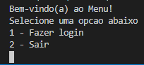

## Introdução

Este readme está dividido em:

- Introdução
- Descrição
- Funcionalidades
- Como instalar
- Imagem

## Descrição

Trata-se de um sistema onde os profissionais da saúde devem realizar o login (informando o usuário e a senha) e informar os dados pessoais do paciente que testou positivo para Covid. Os dados serão salvos em um Arquivo. O sistema vai calcular a idade e verificar se o paciente possui alguma comorbidade e se pertence ao grupo de risco. Caso o paciente pertença ao grupo de risco, o sistema vai salvar um arquivo de texto com o CEP e a idade do paciente para que essa informação possa ser enviada para a central da Secretaria de Saúde da cidade.

## Funcionalidades

O programa inicia com o menu principal onde o funcionário pode fazer o login ou sair.
Ao escolher fazer login, deve digitar o usuário (digitar "funcionario") e senha (digitar "senha") para acessar o sistema. O sistema pede o login e senha até que o usuário digite os valores corretos.
Uma vez feito o login, o usuário pode fazer logout, encerrar o sistema ou cadastrar o paciente.
Ao selecionar o cadastro de paciente, o sistema pergunta a quantidade de pacientes e alguns dados como nome, cpf, etc.
Ao finalizar, o sistema salva um arquivo texto na respectiva pasta.

## Como instalar

Para instalar, basta baixar ou clonar o projeto e abrir o arquivo "PIM4.c" no CodeBlocks ou no VSCode, por exemplo.

Para baixar o CodeBlocks [clique aqui](http://www.codeblocks.org/downloads)
Você também vai precisar baixar o compilador [MinGW](https://osdn.net/projects/mingw/releases/)
Caso precise de ajuda para instalar o compilador, assista este [vídeo](https://www.youtube.com/watch?v=bEs-5IU_l9w&ab_channel=RodrigoRochaGomeseSouza)

Para rodar o código no VSCode, dê uma olhada neste [tutorial](https://medium.com/@juniortrojilio/preparando-o-vs-code-para-compilar-c-c-no-windows-988f4a91a557)

## Imagem do Projeto

